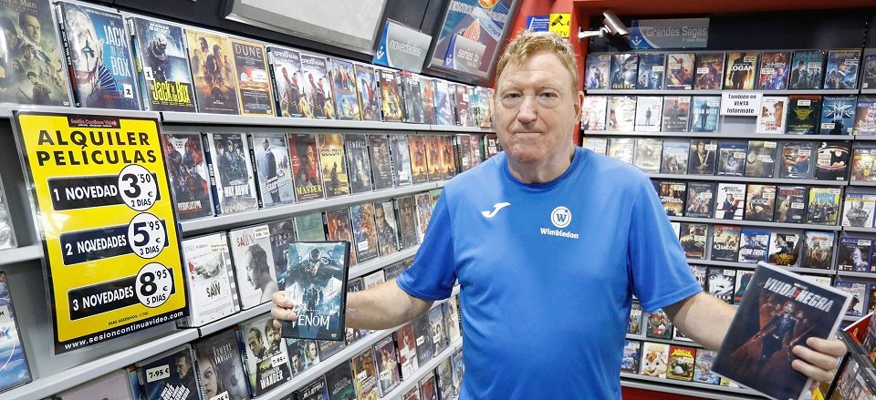
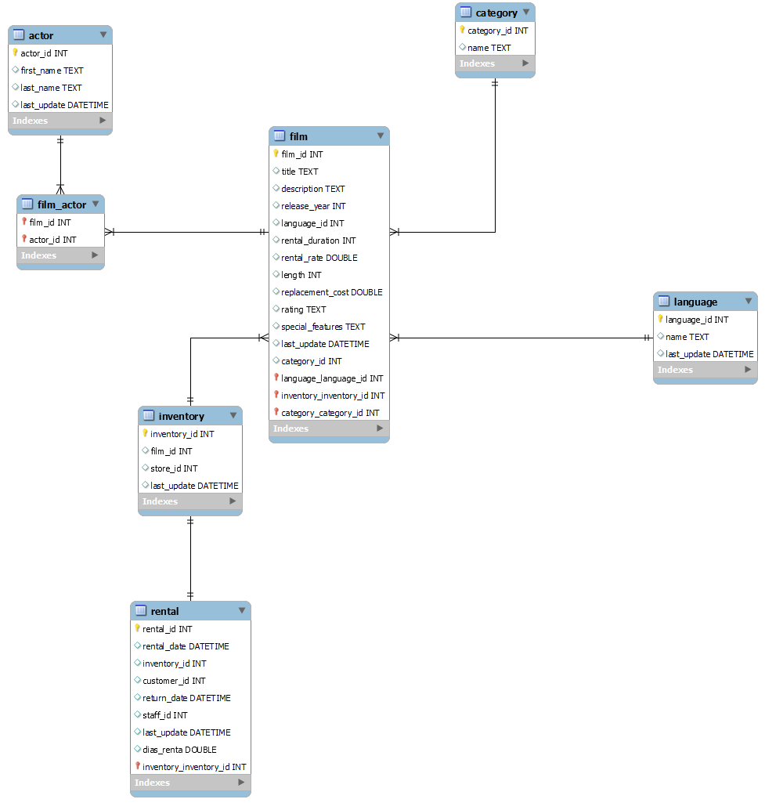

## Proyecto SQL

## Limpieza de la base de datos 🧹

En este proyecto se nos otorgaron las diferentes bases de datos: actor.csv, category.csv, film.csv, inventory.csv, language.csv ,old_HDD.csv y rental.csv. Las mismas se encuentran dentro de la carpeta data.

Para la limpieza de estos archivos utilice pandas como herramienta. La limpieza se baso en quitar aquellas columnas que contengan nulos y ordenar las columnas para obtener mejores resultados. Tambien cree nuevas columnas para futuros analisis en sql y conecte la tabla de old con la de actores para que la misma tenga el actor_id y facilitar el futuro analisis.

## Importacion de los csv a SQL 🐬

Para esta parte cree un database llamado peliculas al que le fui importando los csv ya limpios.
Con la base ya importada al database, por medio del reverse engineer continue estableciendo las relaciones entre las tablas. En base a mi criterio, quede con las siguientes relaciones:

## Analisis y resultados finales 🔎

En cuanto al analisis, puse como objetivo analizar aquellos datos que resultan interesantes a la hora de replantearse abrir nuevamente una cadena de videoclub.

El primer analisis es sobre las peliculas que la gente alquila por mas tiempo, por ende la que menos esta en la tienda. Esto nos da una referencia de cuales peliculas comprar mal y cuales no es necesario.

Estudiamos el costo de comprar nuevamente cada pelicula, en caso de perdida.  Obteniendo asi las peliculas mas costosas y con esto poder comparar a futuro si alguna da perdida.

Continuamos con el estudio de las peliculas que mas dinero recaudan, y asi ver si conviene comprar mas copias de la misma.

Luego, analizamos las categorias que mas se tiene en la base de datos para luego poder comprar en caso de necesario con la demandada y ver si el local da a basto o es necesario comprar mas.

Por ultimo, obtuve el numero de peliculas por rating. Reflejando valores que indican la cantidad peliculas que tiene el local segun su rating.

